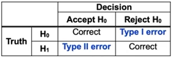

## History

### Machine Learning workflow
- Problem Statement
- Data Collection
- Data Exploration and Preprocessing
- Modeling
- Validation
- Decision making and Deployment

### Error Types
- *Type 1* => Incorrectly reject the null hypothesis (effect is due to chance, but is found to be significant)
- *Type 2* => Incorrectly accept the null hypothesis (effect is ascribed tochance, but is non-coincidental)

Test **Power** =>1 - P(Type II Error)

### Hypothesis testing
- **Significance level** => Threshold below which we will reject the null hypothesis
- **P-Values** => smallest significance level at which to reject null
- **confidence interval** => values of the statistic for which we will accept null
- **F-statistic** => using as null: ther data can be modeled by setting all $\beta$ to 0